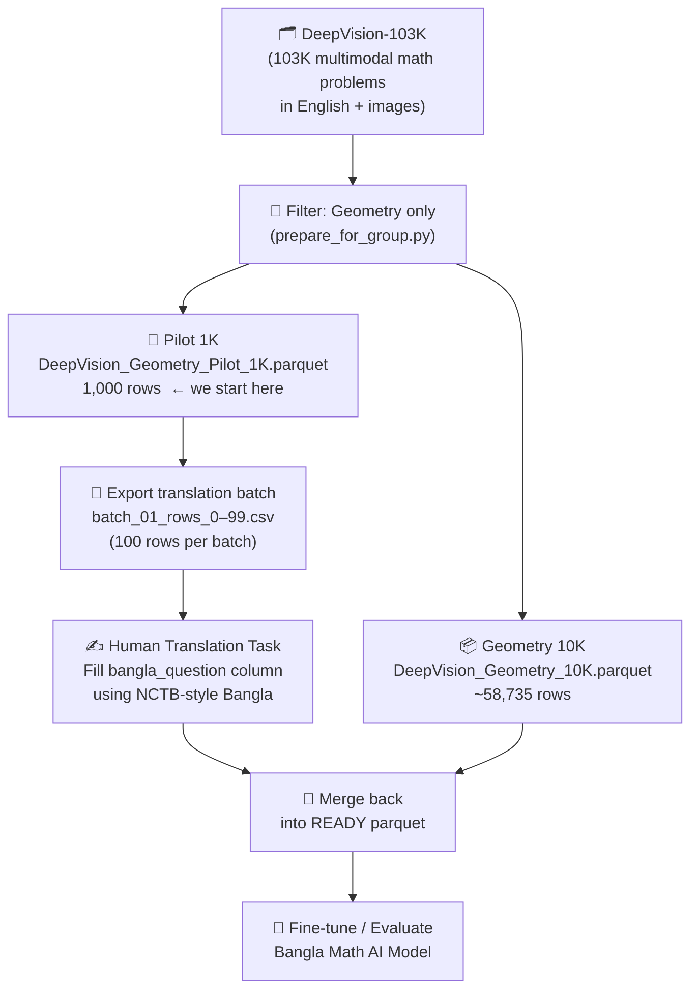
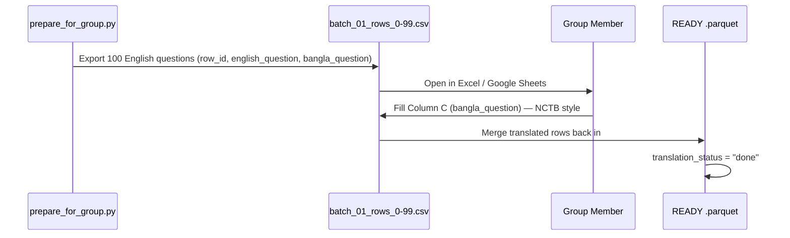

# DeepBanglaMath — What We Are Building

> A quick visual overview for the group. Prepared: February 24, 2026.

---

## The Big Picture



---

## What "NCTB-Style Bangla" Means

NCTB = **জাতীয় শিক্ষাক্রম ও পাঠ্যপুস্তক বোর্ড**  
(National Curriculum and Textbook Board, Bangladesh)

| Rule | Explanation |
|---|---|
| **Formal register** | Use the formal/literary Bangla style found in NCTB textbooks — no colloquial words |
| **Bangla numerals** | Convert `20` → `২০`, `28` → `২৮`, etc. |
| **Standard math terms** | ত্রিভুজ (triangle), সমকোণী (right-angled), ক্ষেত্রফল (area), দৈর্ঘ্য (length), বর্গ সেন্টিমিটার (sq. cm) |
| **LaTeX kept as-is** | Do not translate `\(BC=2\)` or `$x^2$` — keep math notation unchanged |
| **Image placeholder kept** | The `<image>` tag stays in the prompt, do not remove it |

---

## Row 0 — Concrete Example

This is the very first question in our pilot batch.

### English (source)

> In the figure, triangle ABC is a right triangle. The area of the shaded part ① is 28 square centimeters smaller than the area of the shaded part ②. Given that AB = 20 centimeters, what is the length of BC?

### NCTB-Style Bangla (target)

> চিত্রে, ত্রিভুজ ABC একটি সমকোণী ত্রিভুজ। ছায়াযুক্ত অংশ ①-এর ক্ষেত্রফল ছায়াযুক্ত অংশ ②-এর ক্ষেত্রফল অপেক্ষা ২৮ বর্গ সেন্টিমিটার ছোট। AB = ২০ সেন্টিমিটার হলে, BC-এর দৈর্ঘ্য কত?

### Side-by-Side Breakdown

| English phrase | Bangla translation | Note |
|---|---|---|
| In the figure | চিত্রে | Standard NCTB opener |
| triangle ABC | ত্রিভুজ ABC | Letter labels kept in English |
| is a right triangle | একটি সমকোণী ত্রিভুজ | সমকোণী = right-angled |
| the shaded part ① | ছায়াযুক্ত অংশ ① | Symbol ① kept unchanged |
| 28 square centimeters smaller than | ২৮ বর্গ সেন্টিমিটার ছোট | Bangla numeral used |
| AB = 20 centimeters | AB = ২০ সেন্টিমিটার | Bangla numeral; label kept |
| what is the length of BC? | BC-এর দৈর্ঘ্য কত? | Question form matches NCTB style |

---

## Translation Workflow Per Batch



---

## Column Structure We Add

```
Original dataset columns
│
├── question              ← English question text  (already exists)
├── bangla_question       ← Bangla translation     (we fill this)
├── translation_status    ← "pending" → "done"     (we track this)
├── bangla_prompt         ← Final prompt for model (auto-generated)
└── ... (images, answer, solution, etc.)
```

---

## Our Goal

Take **1,000 pilot geometry problems** from a state-of-the-art English math dataset and produce a fully translated, model-ready **Bangla geometry reasoning dataset** — the first of its kind aligned with NCTB curriculum language.
